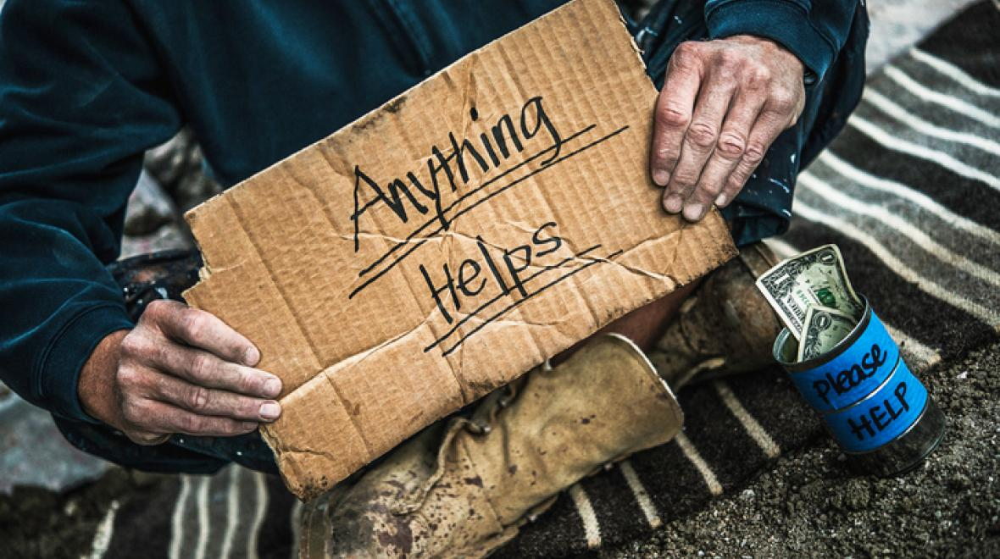

{width=100%}

COVID took a devastating toll on the economy. Businesses shut their doors, employees were laid off, bills went unpaid. Families and individuals working in the service and entertainment industries suddenly found themselves struggling to make ends meet without income, forced to choose between groceries, childcare, and housing.  The housing crisis was worsened as more minimum wage jobs disappeared. Local organizations and non-profits stepped in, providing assistance as they had prior to the pandemic, but how did they handle the crisis? And were they able to provide the same level service they had during “before-times”?

This post looks at how one organization continued helping its neighbors in the midst of the chaos. Data from the [Clackamas Service Center (CSC)](https://www.cscoregon.org/), a nonprofit located in the greater Portland, Oregon area, illustrates how a houseless assistance program pivoted when COVID-19 struck and how, in turn, a neighborhood came to help the organization.

##  Context

Like many non-profits, Clackamas Service Center arose from need. Located in southeast Portland, the CSC is one of the area’s few social service centers, providing low-income and houseless services to community members of the Clackamas and Multnomah counties. The Clackamas Service Center relies heavily on in-kind donations (food, sanitation items, clothing) as well as volunteers to complete its mission. Pre-pandemic, the center was a location for the houseless to grab a meal 6 days a week, receive mail, and receive medical attention. They could also get a shower, clothing, and "shop" the free market for groceries. 

When the pandemic hit, that changed. Volunteers, who are largely seniors, could no longer serve the center preparing meals without putting themselves at risk. Donors, many of them local businesses, cut back or eliminated their donations straining the Clackamas Service Center further. And the need for food, both from the lunch programs and the free market, increased as the pandemic ravaged.

## The need to eat

Schools, restaurants, and stores may have shut their doors in an attempt to stimy the spread of a disease we knew so little about, but hunger hung on.  Just as school free lunch programs could no longer reach students they way they had in the past, clients at the Clackamas Service Center could no longer get meals and supplies they had. 

The Clackamas Service Center receives bulk food from a number of resources, including the [Oregon Food Bank]( https://www.oregonfoodbank.org/), local bakeries and grocery stores, and restaurants.  The CSC does their best to distribute the thousands of pounds each month.

```{r setup, include=FALSE, warning=FALSE}
knitr::opts_chunk$set(echo = F)
library(moderndive)
library(skimr)
library(dplyr)
library(ggplot2)
library(anytime)
library(lubridate)
library(readr)
library(tidyverse)
library(tsibble)
local({r <- getOption("repos")
r["CRAN"] <- "http://cran.r-project.org"
options(repos=r)})

```

```{r, include=FALSE}

pantry <-  read_csv("index_files/CSC_Pantry.csv")
head(pantry)

```

```{r, include=FALSE}
grantData <-  read_csv("index_files/CSC_Grant_Data.csv")

grantData$Month <- grantData$Month %>%  as.Date(format = "%d-%b-%y")
grantData <- grantData %>% drop_na()
head(grantData)
```

```{r, warning=FALSE, echo=FALSE, out.width="100%"} 
# knitr::opts_chunk$set(echo = TRUE,fig.width = 12,fig.height = 4)
foodDistr <- ggplot(grantData, aes(Month, LbsFood_Distr))+
  geom_line()+
    theme_minimal()+
  scale_y_continuous(labels = scales::comma,
                     limits = c(0, 75000))+
  scale_x_date(date_minor_breaks = "1 month", 
               date_labels = "%b %Y",
               limits = )+
  labs(x = NULL,
       y= "Lbs of Food Distributed", 
       title= "Monthly Food Distribution from the Clackamas Service Center",
       subtitle = "To all programs, including prepared meals and marketplace",
       caption = "Data provided July 2021")
dates_vline <- as.Date(c("2020-04-01"))                
dates_vline <- which(grantData$Month %in% dates_vline)   
foodDistr + geom_vline(xintercept = as.numeric(grantData$Month[dates_vline]), col= "dark green")
```

The vertical line shows April 2020, two weeks into quarantine.  The reader will no doubt note the monthly fluctuations in food distributions, due in large part to changing contributions from suppliers, but also the needs of the clients themselves.

As mentioned above, the CSC offers prepared meals six days a week. Prior to COVID-19, meals were cafeteria style, offering a sense of community and home to those who ate there.  Like restaurants, the Clackamas Service Center turned to to-go style meals to continue serving clients.

COVID-19 also impacted the CSC's ability to offer a free marketplace to clients.  No longer could individuals and browse the pantry shelves themselves.  Mid-March as rumors of quarantine began to swirl, visits to grocery stores spiked; so, too, did marketplace visits escalate.


```{r, include=FALSE}
clientSer <- grantData %>% 
  pivot_longer(
    cols = c(Market_Visits, Boxes, ToGo_Bags), 
    names_to ="Client_Service",
    values_to = "Count")
clientSer <- clientSer %>% 
  select(Month, Client_Service, Count)
clientSer <- as_tsibble(clientSer, key = Client_Service, index = Month)
```

```{r, echo=FALSE}
served <- ggplot(clientSer, aes(Month, Count, fill=Client_Service)) +
  geom_area()+
  theme_minimal()+
   labs(x= NULL,
     y= "Grocery Clients", 
       title= "Monthly Grocery Distribution from the Clackamas Service Center",
       subtitle = "Distribution methods via self service and request",
       caption = "Data provided July 2021")
dates_vline <- as.Date(c("2020-04-01"))                
dates_vline <- which(clientSer$Month %in% dates_vline)   
served + geom_vline(xintercept = as.numeric(clientSer$Month[dates_vline]), col= "dark green")
```


Late March, the CSC pivoted to side-walk grocery pickup; by April, they had fully abandoned the traditional food pantry and moved to delivering boxes of groceries to camps and residences.

## Where is the funding coming from?

The Clackamas Service Center relies on grants, federal funding, and corporate donations, as well as individual contributions, both in volunteer hours and in funding.  

```{r, include=FALSE}
donorData <-  read_csv("index_files/csc_donations-2019.csv")
donorData$rcvdDate <- donorData$Received_Date %>%  as.Date(format = "%d-%b-%y")
donorData <- as_tsibble(donorData, key = Donation_Id, index = rcvdDate)
head(donorData)
```
```{r, echo=FALSE, width = "100%"}
donation <- ggplot(donorData, aes(rcvdDate, Amount, color=Source)) +
  geom_jitter() +
  theme_minimal()+
  scale_y_continuous(labels = scales::comma,
                     limits = c(0, 90000))+  
   labs(x = NULL,
       y= "Contributions, USD($)", 
       title= "Funding Sources for the Clackamas Service Center",
       subtitle = "Distribution methods via self service and request",
       caption = "Data provided July 2021")
donation
```

```{r, include=F}
# load packages
library(tmaptools)
library(RCurl)
library(jsonlite)
library(tidyverse)
library(tidyr)
library(leaflet)
library(ggmap)
library(tidygeocoder)
library(maps)
library(mapview)
library(OpenStreetMap)
library(sp)
library(ggplot2)
library(ggrepel)
library(tidycensus)

```

Below, one can see who and where funding is coming from.  Larger circles are lifetime donations over $1000. 
```{r, warning=FALSE, include=FALSE}
longlatMAP <- read_csv("index_files/latlongStart.csv")
longlatMAP <- longlatMAP[c(1:4,7:8)]
longlatMAP <- longlatMAP %>% drop_na()
#head(longlatMAP)
#mapview(longlatMAP, xcol = "long", ycol = "lat", grid = FALSE)
```

```{r, warning=FALSE, echo=F}
indiv <- longlatMAP %>% 
  filter(Source=="Individual Contributions")
churc <- longlatMAP %>% 
  filter(Source=="Churches & Clubs")
corp <- longlatMAP %>% 
  filter(Source=="Corporate")
found <- longlatMAP %>% 
  filter(Source=="Foundations/Grants/Government")
```


```{r, warning=FALSE, echo=F}
pal <- colorFactor(c("red", "green", "blue", "purple"), domain = c("Churches & Clubs", "Corporate", "Foundations/Grants/Government", "Individual Contributions"))

csc <- leaflet(data= longlatMAP, width = "100%") %>% 
  addProviderTiles(providers$Stamen.Toner) %>% 
  setView(lat= 45.460305507208126, lng= -122.58072654997403, zoom=12) %>% 
  addMarkers(lat= 45.460305507208126, lng= -122.58072654997403, label = "Clackamas Service Center", labelOptions = labelOptions(noHide = T)) %>% 
  addCircleMarkers(~long, ~lat,
    data= churc ,
    radius = ~ifelse(Total_Donations >= 1000, 20, 10),
    color = ~pal(Source),
    stroke = FALSE, fillOpacity = 0.5,
    popup = ~as.character(Total_Donations), label = ~as.character(Total_Donations),
    group= "Churches & Clubs") %>% 
  addCircleMarkers(~long, ~lat,
    data= corp ,
    radius = ~ifelse(Total_Donations >= 1000, 20, 10),
    color = ~pal(Source),
    stroke = FALSE, fillOpacity = 0.5,
    popup = ~as.character(Total_Donations), label = ~as.character(Total_Donations),
    group= "Corporate") %>% 
  addCircleMarkers(~long, ~lat,
    data= found ,
    radius = ~ifelse(Total_Donations >= 1000, 20, 10),
    color = ~pal(Source),
    stroke = FALSE, fillOpacity = 0.5,
    popup = ~as.character(Total_Donations), label = ~as.character(Total_Donations),
    group= "Foundations/Grants/Government") %>%  
  addCircleMarkers(~long, ~lat,
    data= indiv,
    radius = ~ifelse(Total_Donations >= 1000, 20, 10),
    color = ~pal(Source),
    stroke = FALSE, fillOpacity = 0.5,
    popup = ~as.character(Total_Donations), label = ~as.character(Total_Donations),
    group= "Individual Contributions") %>%   
  addLayersControl(
    # baseGroups = c("OSM (default)", "Toner", "Toner Lite"),
    overlayGroups = c("Churches & Clubs", "Corporate", "Foundations/Grants/Government", "Individual Contributions"),
    options = layersControlOptions(collapsed = FALSE) )
csc
```


```{r, include=FALSE}
# Set a year of interest
this.year = 2019

# This looks at the 5 year estimates
# You can also do "acs1"
vars <- load_variables(year = this.year,
                      dataset = "acs5",
                      cache = TRUE)

# There are 25070 possible variables 
dim(vars)
```

```{r, warning=F, include=FALSE}
# MEDIAN HOME VALUE
orMedvG <- get_acs(geography = "tract", year=this.year,
               state = "OR", county = c("Multnomah", "Clackamas"),
               variables = "B25077_001E", 
               geometry = TRUE)
```

Below is the median home values overlayed with lifetime donations from all sources.
```{r, warning=F, echo=FALSE}
qpal<-colorQuantile("viridis", domain=orMedvG$estimate,
                       n=5,na.color="#FFFFFF")
popup<-paste(#"Tract: ", as.character(substring(orMedvG$GEOID, 6, 11)), "<br>",
             "Median Home Value: ", as.character(orMedvG$estimate))
leaflet(width = "100%")%>%
  addProviderTiles(providers$Stamen.Toner)%>%

  setView(lat= 45.460305507208126, lng= -122.58072654997403, zoom=10) %>% 
  addMarkers(lat= 45.460305507208126, lng= -122.58072654997403, label = "Clackamas Service Center",
    labelOptions = labelOptions(noHide = T)) %>% 

  
  
  addPolygons(data=orMedvG,
              fillColor= ~qpal(orMedvG$estimate),
              fillOpacity = 0.8,
                  color="grey",
                  opacity=.5,
                  weight = 0.4,
                  smoothFactor = 0.2,
                  popup = popup)%>%
  
  addCircleMarkers(~long, ~lat, data=longlatMAP,
        radius = ~ifelse(Total_Donations >= 1000, 20, 10),
        stroke = FALSE, fillOpacity = 0.3,
        popup = ~as.character(Total_Donations), label = ~as.character(Total_Donations)
         ) %>% 
  addLegend("bottomright", pal=qpal, values=orMedvG$estimate,
                opacity = .7,
                title="Home Value Percentile")
```


## Wrap

As a non-profit, the Clackamas Service Center does an excellent job of tracking their monetary donations and who their donors are. They know basic information about the donors, how often they give, and how much. They know how much monetary value is distributed through to their staff and the items purchased to support their programs directly. They also track in-kind donations and volunteer hours.

The picture of who their clients are and how to best serve them suffered during COVID-19, as volunteers focused on helping and serving clients rather collecting data on them. Prior to the pandemic, the integerity of the data hinged on the willingness of clients to disclose their information.

Non-profits across the country were forced to pivot in 2020 when their sources of financial support fell short. Many organizations that serve the houseless and food-insecure found themselves doubly hit when the need for their services increased as individuals lost their jobs. Illustrating how money and services flow in non-profits, through donations and distribution, will help organizations like the Clackamas Service Center prepare for local and national crises.

#### Note
The are some limitations to be assumed with the data, as it is all manually entered; one can assume that the volunteers who would have collected the data were also impacted by COVID. Sensitive information has been redacted. 
